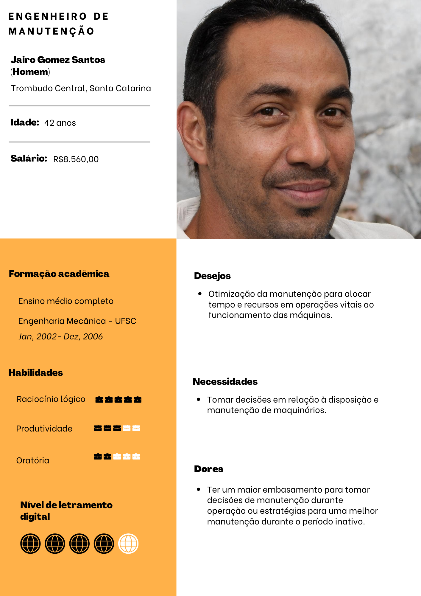
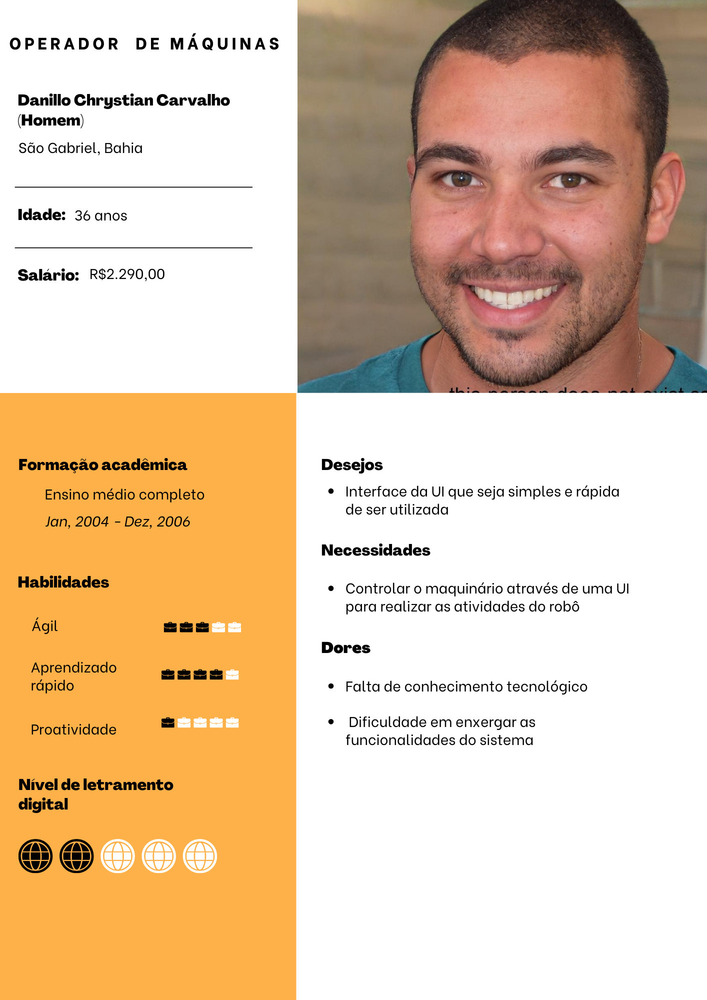

## Definição de Personas

Primeiramente, a fim de desenvolver um projeto que ajude a resolver as problemáticas de maneira mais precisa, é necessário uma análise dos usuários potenciais que do sistema, mapear suas características, dores e necessidades. Esses personagens são chamados de **personas**, e possuem o objetivo de auxiliar a equipe de desenvolvimento a pensar nos **requisitos funcionais e não funcionais** do sistema, por ser uma representação um pouco mais tangível das pessoas que serão impactadas diretamente pela implementação do projeto.

Pensando no contexto da Atvos, foram mapeadas duas personas: um Engenheiro de Manutenção e um Operador de Maquinário. 

Abaixo, é possível observar pontos chaves da persona do Jairo, o engenheiro de manutenção.

**Persona 1 - Jairo**

**Fonte:** Elaborado pela equipe Rebólins

Como visto acima, o Jairo é o Engenheiro de Manutenção da Atvos. Dentre as atividades dele em seu trabalho, uma delas é justificar que o trabalho de manutenção está sendo bem feito. Porém, fazer isso sem dados é um pouco complexo, já que atualmente não é possível visualizar se os canos do reboiler (aparelho usado nas usinas da atvos para produzir o açúcar a partir do melaço) foram realmente desentupidos. 

A partir dessa persona, é possível mapear as seguintes **user stories**:

- User Story 1: “Como **engenheiro de manutenção**, quero que o robô realize **inspeções de forma autônoma** para **melhor distribuição do tempo** do processo”

- User Story 2: “Como **engenheiro de manutenção**, quero ter acesso a **dados em relação ao nível de limpeza dos canos** para conseguir **medir a eficiência** do processo de limpeza e manutenção dos reboilers”

- User Story 3: “Como **engenheiro de manutenção**, quero que o **robô detecte corretamente** quais canos ficaram sujos, para ter **acesso a dados confiáveis**”

**Persona 2 - Danillo**

**Fonte:** Elaborado pela equipe Rebólins

O Danillo é um operador de máquinas da Atvos. Ele é responsável por operar o sistema utilizado para controlar o robô na limpagem do reboiler, e por isso, precisa de uma interface clara, intuitiva e fácil de ser utilizada.

A partir dessa persona, é possível mapear as seguintes **user stories**:

- User Story 1: “Como **operador de máquinas**, quero que **o robô consiga mapear o espaço embaixo do reboiler em uma operação prévia**, para que a **inspeção autônoma ocorra com precisão e eficiência após esse processo**”

- User Story 2: “Como **operador de máquinas**, quero uma **plataforma intuitiva e clara** de operação do robô, para poder **acionar a inspeção no momento desejado e com facilidade**”

- User Story 3: “Como **operador de máquinas**, quero que **a plataforma me informe ao final da inspeção se há algum cano sujo**, para que eu possa **reportar à equipe de limpeza a necessidade de uma nova limpeza**”