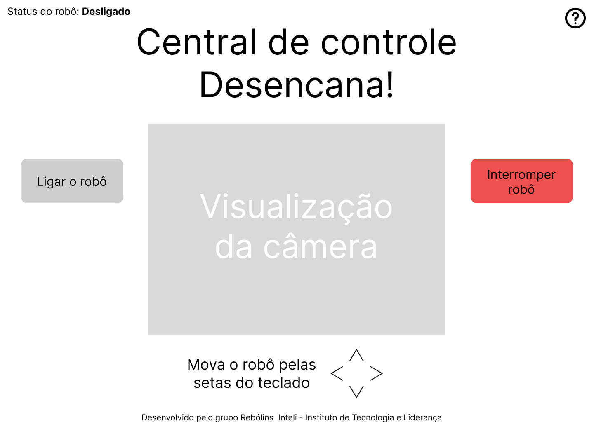

# Interface de Usuário

A interface de usuário "Central de Controle Desencana!" foi criada para facilitar a interação entre os operadores e o sistema de controle do robô. Esta interface intuitiva e de fácil manuseio permite que o operador de máquinas controle o robô remotamente com eficiência.

**Fonte:** Elaborado pela equipe Rebólins

No canto superior esquerdo da tela, o status atual do robô é claramente exibido, podendo estar "Desligado" — indicando que o robô não está em operação — ou "Ligado", que mostra que o robô está ativo. A interface principal é organizada com dois botões proeminentes: um botão cinza e inativo à esquerda para ligar o robô, e um botão vermelho à direita, que funciona como um botão de emergência para interromper as operações do robô se necessário, com sua cor destacando sua importância.

No centro da tela, há uma área dedicada para a visualização da câmera do robô, permitindo que o operador monitore as ações do robô em tempo real. Instruções logo abaixo mostram como mover o robô usando as setas do teclado, oferecendo controle remoto efetivo e direto.

A parte inferior da tela reconhece o "grupo Rebôlins Inteli - Instituto de Tecnologia e Liderança" como os desenvolvedores da interface, destacando a colaboração na criação desta ferramenta essencial. A combinação de simplicidade e funcionalidade faz desta interface uma solução prática e acessível para a gestão remota do robô.

Por fim, um ícone de ponto de interrogação no canto superior direito serve como um atalho para o menu de ajuda, onde os usuários podem encontrar informações adicionais sobre a operação da interface e do robô.

## Desenvolvimento

A interface de usuário foi desenvolvida utilizando um html e css simples, com o objetivo de criar uma interface intuitiva e de fácil manuseio. O código foi organizado de forma a facilitar a manutenção e a adição de novas funcionalidades no futuro. Além disso, foi utilizado o javascript para a implementação de funcionalidades interativas, como o controle remoto do robô através de teclas do teclado.