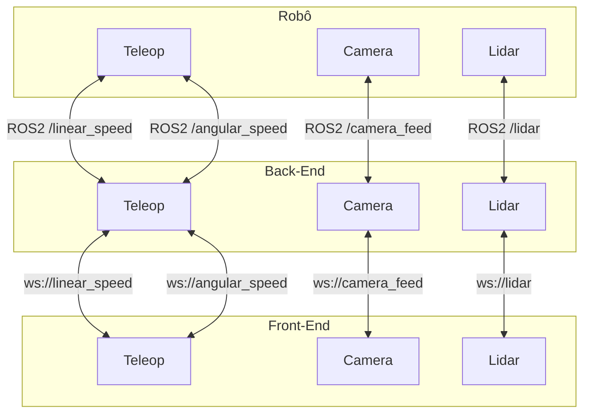

## Introdução

Nesta seção, fornecemos uma visão abrangente da arquitetura de solução do nosso sistema de controle de robôs. A arquitetura é dividida em três principais subsistemas: Back-End, Robô e Front-End. Cada subsistema desempenha um papel crucial na comunicação e operação do robô.

- O [**Robô**](./Robô) executa nodes específicos para controle de movimento, aquisição de imagens e detecção de obstáculos, todos desenvolvidos em ROS2.
- O [**Back-End**](./Back-end) orquestra a comunicação entre o Front-End e o Robô, utilizando tecnologias como ROS2 e WebSockets.
- O [**Front-End**](./Front-End) fornece uma interface intuitiva para os usuários controlarem o robô e visualizarem informações em tempo real.

## Diagrama de Arquitetura

O diagrama abaixo representa a comunicação entre os subsistemas Back-End, Robô e Front-End, destacando os componentes de teleoperação, câmera e lidar.



# Instruções de execução

Para executar o projeto, siga as instruções abaixo:

Clone o repositório:

```bash
git clone git@github.com:Inteli-College/2024-1B-T08-EC06-G03.git
cd 2024-T0008-EC06-G03/
```

## Robô

1. Instale o [ROS2](https://docs.ros.org/en/humble/Installation.html)

2. Acesse a pasta do robô

```bash
cd src/bolin/
```

3. Execute o robô

```bash
source ./run.sh
```

## Back-End

1. Instale o [Node.js](https://nodejs.org/en/download/)

2. Acesse a pasta do Back-End

```bash
cd src/backend/
```

3. Instale as dependências

```bash
npm install
```

4. Execute o Back-End

```bash
npm start
```

## Front-End

1. Instale o [Node.js](https://nodejs.org/en/download/)

2. Acesse a pasta do Front-End

```bash
cd src/frontend/
```

3. Instale as dependências

```bash
npm install
```

4. Execute o Front-End

```bash
npm run dev
```

5. Acesse [http://localhost:5173](http://localhost:5173) no seu navegador.
