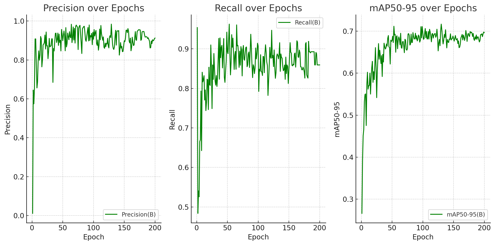

# Modelo de Visão Computacional - YOLO

## O Modelo

O YOLO (You Only Look Once) é um modelo de visão computacional voltado para a detecção de objetos em imagens em tempo real. Proposto por Joseph Redmon e Ali Farhadi em 2015, o YOLO se destaca por sua rapidez e eficiência na identificação de objetos.

## Funcionamento

O YOLO utiliza uma única rede neural convolucional para prever múltiplas caixas delimitadoras e as probabilidades associadas a essas caixas. O modelo divide a imagem em uma grade e, para cada célula da grade, prevê as caixas e suas probabilidades em apenas uma avaliação, tornando-o extremamente eficiente.

## Escolha do Modelo

O YOLO foi escolhido por sua velocidade e precisão na detecção de objetos, sendo capaz de processar imagens a uma taxa de 45 frames por segundo. Além disso, sua capacidade de operar em tempo real é crucial para o contexto do projeto. Comparado a outros modelos de detecção de objetos, o YOLO é menos propenso a predições falsas e pode localizar erros com maior eficiência.

Optamos pela versão YOLOv8 devido à sua documentação clara e simplificada, que facilita o entendimento e a implementação do modelo.

## Treinamento do Modelo

### Dataset

O dataset utilizado para treinar o modelo foi o `Precision SG Subterranean`, que contém mais de 260 imagens de ambientes semelhantes a canos de reboilers, focando na detecção de sujeira nesses ambientes. Esse dataset foi escolhido por suas imagens de alta qualidade e por ser de acesso público, o que facilita a replicação dos resultados.

## Resultados

Os resultados obtidos podem ser observados na imagem abaixo:

**Fonte:** Elaborado pela equipe Rebólins

O modelo alcançou uma precisão estável entre 80% e 90% em todas as imagens testadas, indicando uma alta capacidade de detecção de sujeira nos canos de reboilers. Além disso, o modelo apresentou um alto recall, demonstrando ser capaz de detectar a maioria dos objetos presentes nas imagens.

## Bibliografia

[1] ALVES, Gabriel. Detecção de Objetos com YOLO – Uma abordagem moderna. Disponível em: [https://iaexpert.academy/2020/10/13/deteccao-de-objetos-com-yolo-uma-abordagem-moderna/?doing_wp_cron=1717618413.5629088878631591796875](https://iaexpert.academy/2020/10/13/deteccao-de-objetos-com-yolo-uma-abordagem-moderna/?doing_wp_cron=1717618413.5629088878631591796875). Acesso em: 06 de junho de 2024.

[2] REDMON, Joseph; DIVVALA, Santosh; GIRSHICK, Ross; FARHADI, Ali. You Only Look Once: Unified, Real-Time Object Detection. Disponível em: [https://arxiv.org/abs/1506.02640](https://arxiv.org/abs/1506.02640). Acesso em: 06 de junho de 2024.