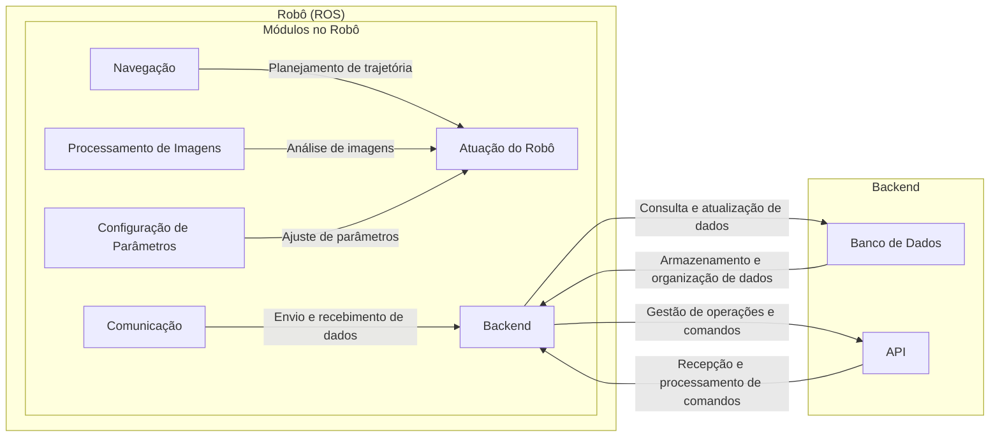

# Arquitetura da solução

A arquitetura proposta para o sistema de inspeção de reboilers é projetada para garantir eficiência operacional e escalabilidade. Com base no framework ROS (Robot Operating System) para controle e comunicação de robôs, a arquitetura se divide em módulos distintos tanto no robô quanto no backend.

No robô, os módulos abrangem desde a navegação e processamento de imagens até a configuração de parâmetros e comunicação com o backend. Essa estrutura permite uma operação autônoma e adaptativa do robô durante as inspeções.

No backend, um banco de dados centralizado armazena informações cruciais sobre os robôs em operação e as operações em andamento, enquanto uma API fornece uma interface para gerenciar e monitorar esses dados.

## Módulos no Robô:

1. **Módulo de Navegação:**

   - Responsável pelo planejamento de trajetória e atuação do robô durante a operação.
   - Utiliza algoritmos de navegação do ROS para determinar a rota mais eficiente e segura.

2. **Módulo de Processamento de Imagens:**

   - Captura e processa imagens durante a inspeção.
   - Utiliza bibliotecas de visão computacional para análise de imagens e detecção de sujeira nos reboilers.

3. **Módulo de Configuração de Parâmetros:**

   - Permite a configuração de parâmetros específicos do robô, como velocidade, área de inspeção, constantes de controle, entre outros.

4. **Módulo de Comunicação:**
   - Gerencia a comunicação entre o robô e o backend, enviando dados de status, recebendo comandos e atualizações de parâmetros.

# Backend com Banco de Dados e API:

1. **Banco de Dados:**

   - Armazena informações sobre os robôs em operação, seus status, localizações, operadores envolvidos, entre outros dados relevantes.
   - Organiza os dados por chamados de operação para facilitar a gestão e monitoramento.

2. **API:**
   - Fornece uma interface para gerenciar os dados dos robôs em operação, permitindo consultar o status, localização e outros detalhes.
   - Recebe e processa comandos para iniciar, pausar ou encerrar operações dos robôs.
   - Comunica-se com os robôs para obter e atualizar os dados e os comandos necessários para sua operação.

# Integração entre Módulos:

- O Módulo de Comunicação no robô utiliza o ROS para enviar e receber mensagens do backend, mantendo-o informado sobre seu status e recebendo comandos para ajustar sua operação.
- A API do backend interage com o banco de dados para fornecer informações atualizadas sobre os robôs em operação e gerenciar as operações em andamento.
- O banco de dados armazena os dados dos robôs e das operações, permitindo que a API os acesse e os disponibilize conforme necessário.

Essa arquitetura permite uma comunicação eficiente entre os robôs em operação e o backend, garantindo que as operações sejam coordenadas e monitoradas de forma adequada.

Abaixo está a arquitetura representada

