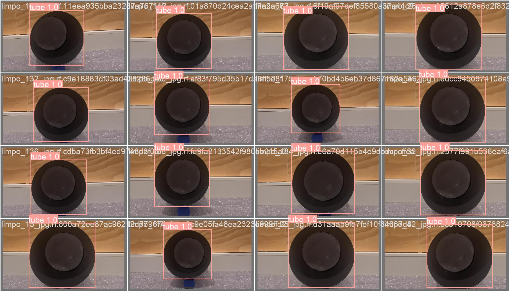
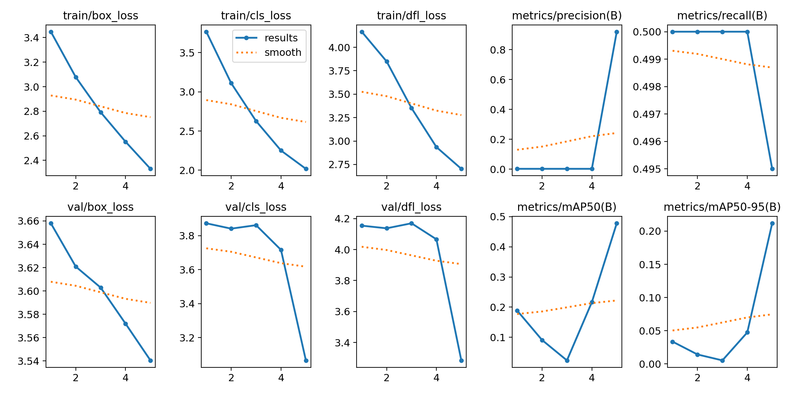
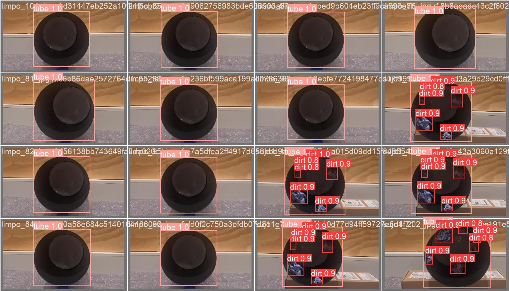
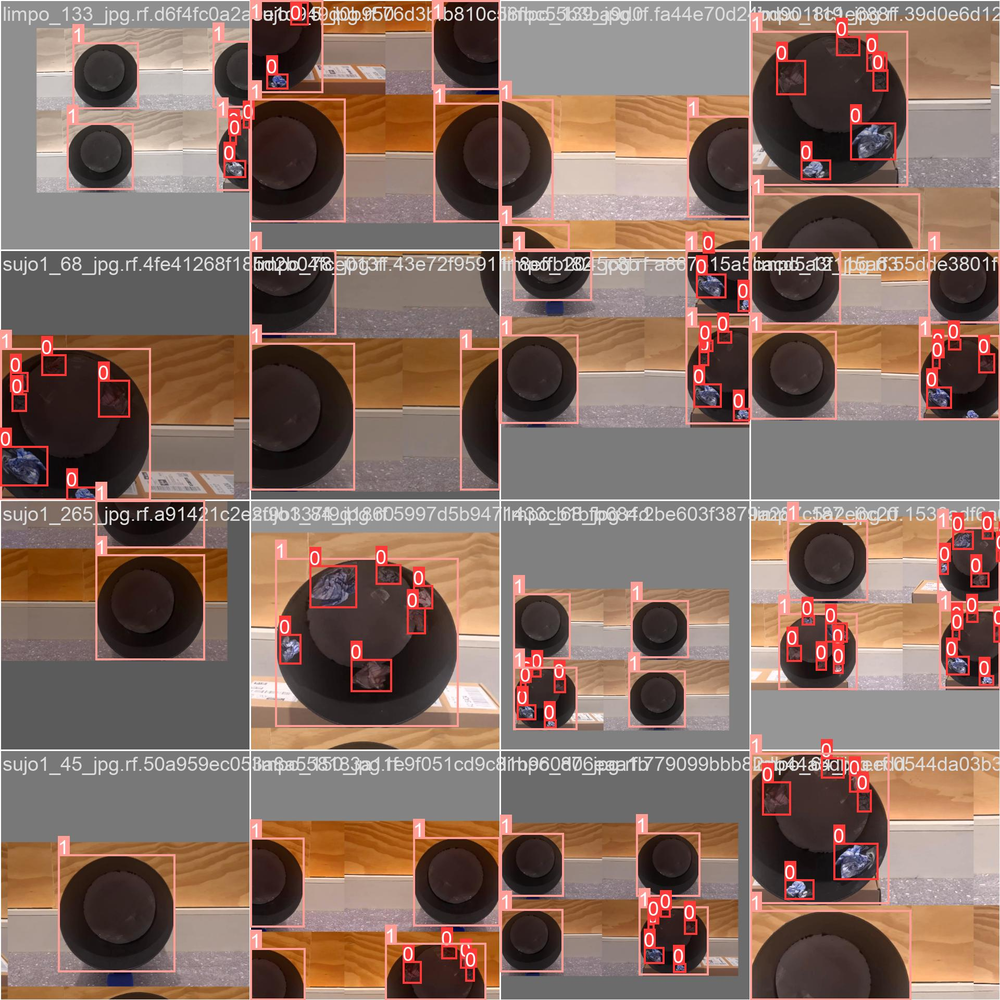

# Modelo de Visão Computacional - YOLO

Um dos requisitos para o funcionamento desse projeto é a detecção de resíduos dentro dos tubos, a fim de determinar o grau de impureza dentro dos reboilers. Para isso, utilizamos um modelo de [visão computacional](https://aws.amazon.com/pt/what-is/computer-vision/), o [YOLOv8](https://docs.ultralytics.com/models/yolov8/), que é voltado para a detecção de objetos em imagens em tempo real.

## Escolha de versão do modelo

No projeto, foi decidida a utilização da versão [YOLOv8](https://docs.ultralytics.com/models/yolov8/), por ser a última versão de lançamento realizado, evitandos bugs. Além disso, a YOLOv8 possui mais exemplos encontrados online, facilitando o aprendizado dos desenvolvedores e implementação, já que a documentação é mais rica, o que não é o caso da versão [YOLOv10](https://docs.ultralytics.com/models/yolov10/), que foi lançada durante o desenvolvimento desse projeto, e ainda não tem muitos casos de uso.

## Treinamento do Modelo

### Dataset

Para definir o dataset, foi necessária uma série de pesquisas a fim de encontrar um que se encaixasse no contexto do problema e, ao mesmo tempo, *open source* para ser utilizado no projeto, uma vez que a empresa parceira não pôde disponibilizar imagens dos canos dos reboilers.

O dataset utilizado para treinar o modelo foi o [`Tacomare Computer Vision Project`](https://universe.roboflow.com/project-y7tgq/tacomare), que contém mais de 500 imagens de cilindros com diferentes graus de sujidade, sendo mais de 350 delas separadas para treino e 100 separadas para teste, sendo que este identifica as classes "tube" e "dirt" (tubo e sujeira, respectivamente). Esse dataset foi escolhido por possuir imagens de alta qualidade e por ser de acesso público, facilitando a replicação dos resultados, além de facilmente aplicável para testes e utilização em razão do contexto do projeto, isso com o auxílio da plataforma [`Roboflow`](https://roboflow.com/), especializada na disponibilização de datasets para projetos específicos.

<div align="center">

**Exemplos de imagens presentes do dataset utilizado**



**Fonte:** Elaborado pelo modelo YOLOv8

</div>

### Implementação

Para a implementação do treinamento do modelo, foram utilizadas as bibliotecas `Roboflow` e `Ultralytics`, as quais são amplamente utilizadas para treinamento de modelos de visão computacional. A biblioteca `Ultralytics` é uma API que facilita o treinamento de modelos YOLO, enquanto a `Roboflow` é uma plataforma que permite a organização e pré-processamento de imagens para treinamento de modelos de visão computacional. 

Abaixo há um exemplo do código utilizado para o treinamento do modelo:

```python
# Instalação das bibliotecas necessárias
from roboflow import Roboflow
from ultralytics import YOLO

# Definição do modelo YOLO
model = YOLO("yolov8n.yaml")

# Treinamento do modelo
results = model.train(data="Tacomare-2/data.yaml", epochs=100) 
```

Inicialmente, o modelo havia sido treinado com 5 épocas no total. Todavia, como a eficiência das previsões não atingiu um nível satisfatório, o número foi aumentado para 100.

## Avaliação e métricas do modelo

As métricas de avaliação, como precisão (precision), recall, mAP50 e mAP50-95, auxiliam na garantia da eficiência da detecção de sujeira em tubos de reboilers e impactam diretamente a eficiência do projeto. A precisão mede a proporção de verdadeiros positivos entre todas as detecções positivas, gerenciando caso de falsas acusações, ou seja, o modelo acusando de sujeira quando não há. Isso garante com que o modelo evite de soar alarme falso. Já o recall avalia a proporção de verdadeiros positivos entre todas as instâncias reais, assegurando que sempre que houver um tipo de sujeira, o modelo seja capaz de identificá-la. No caso do projeto, a métrica do recall e da precisão são igualmente importantes, visto que para avaliar a limpeza é necessário saber onde havia sujeira e o quanto dela foi eliminada. 

Em relação ao mAP50, que considera a média da precisão com um limiar de Intersection over Union (IoU) de 0.50, oferece uma medida inicial da eficácia do modelo. Já o mAP50-95 calcula a média da precisão em múltiplos limiares de IoU, proporcionando uma visão mais completa da performance do modelo em diferentes níveis de exigência. Estas métricas garantem confiabilidade, eficiência operacional, segurança e qualidade dos dados, suportando decisões estratégicas de manutenção e contribuindo para um planejamento mais eficaz.

As métricas de perda, do inglês *loss*, fundamentais no treinamento de modelos de aprendizado de máquina, incluem Box Loss, Classification Loss e Distribution Focal Loss, impactando diretamente a otimização do projeto. A Box Loss mede o erro na localização e dimensão das caixas delimitadoras, sendo assim visando uma maior precisão na detecção de resíduos. A Classification Loss avalia o erro na identificação de sujeira versus tubo, crucial para decisões de manutenção precisas e confiabilidade dos dados. A Distribution Focal Loss foca em melhorar a performance do modelo em classes difíceis de distinguir, assegurando a detecção de pequenos resíduos críticos para a performance do sistema. Reduzir essas perdas durante o treinamento ajusta os pesos do modelo, melhorando sua eficácia e precisão. Essas métricas são vitais para otimizar o modelo, garantindo detecções confiáveis e suportando intervenções de manutenção eficientes, resultando em operações mais seguras e econômicas. Para aprofundamento, consulte "A Survey of Evaluation Metrics Used for Object Detection" por T. Reinke et al. e "Deep Learning" por Ian Goodfellow, Yoshua Bengio e Aaron Courville.

### Resultados

Para uma visualização mais clara dos resultados obtidos com o treinamento do modelo, é possível observar no gráfico abaixo o desempenho dele nas métricas **precisão, recall, mAP50 e mAP50-95** durante cada uma das 100 épocas de treinamento. 

Além das principais métricas, também é possível observar o desempenho do modelo em relação às métricas **Box Loss, Classification Loss e Distribution Focal Loss**, sendo que as três foram medidas em relação ao treino e validação do modelo.

<div align="center">

**Níveis das métricas em 100 épocas**


**Fonte:** Elaborado pelo modelo YOLOv8

</div>

Os resultados do treinamento do modelo YOLOv8 mostram um impacto direto no projeto, apresentando uma evolução notável na performance do modelo. A perda de bounding box durante o treinamento (train/box_loss) diminui de 3,5 para 0,5, indicando que o modelo aprende a localizar as caixas delimitadoras com mais precisão. Com isso, a detecção de resíduos nos tubos fica mais precisa, permitindo uma manutenção mais eficiente e reduzindo intervenções desnecessárias. A perda de classificação (train/cls_loss) também diminui de 3,5 para 0,5, sugerindo melhorias na identificação dos objetos dentro das caixas, o que aumenta a confiabilidade do sistema de detecção.

Ademais, a perda de focalização de distribuição (train/dfl_loss) cai de 4 para 1, indicando melhorias na previsão da distribuição das bounding boxes, essencial para a detecção de resíduos de diferentes tamanhos e formas. Métricas como precisão (metrics/precision(B)) e recall (metrics/recall(B)) atingem valores próximos de 1, demonstrando que o modelo se torna preciso e eficaz em detectar a maioria dos objetos após algumas épocas de treinamento. Isso garante que o sistema possa identificar sujeira de forma consistente e precisa, suportando decisões de manutenção baseadas em dados confiáveis.

Durante a validação, as perdas de bounding box (val/box_loss) e de classificação (val/cls_loss) apresentam quedas similares, reforçando a capacidade do modelo de generalizar bem em dados não vistos. A métrica mAP50 (metrics/mAP50(B)) rapidamente atinge cerca de 1, indicando alta precisão na detecção de objetos com um limiar de 50%, enquanto a mAP50-95 (metrics/mAP50-95(B)) alcança cerca de 0,85, mostrando uma melhora progressiva em detectar objetos com vários limiares de sobreposição. Esses resultados satisfatórios trazer maior garantia em relação a eficácia e confiabilidade do modelo, otimizando a inspeção e manutenção dos tubos de reboilers, e suportando decisões estratégicas e operacionais com base em dados precisos e completos.

### Comparação entre os modelos treinados

Antes de finalizar o treinamento do modelo, foi feito um treinamento com 5 épocas para avaliar seu desempenho inicial. Abaixo, é possível observar um gráfico com algumas das métricas utilizadas para medir o modelo de 100 épocas, porém com 5:

<div align="center">

**Métricas após treinamento de 5 épocas**



**Fonte:** Elaborado pelo modelo YOLOv8

</div>

Analisando o gráfico acima, é notável que, apesar de apresentar bons resultados, o modelo mostrava tendência a melhorar em todas as métricas, mas ainda não havia atingido o seu potencial máximo. Por exemplo, a precisão mostra um aumento repentino na última época, enquanto o recall apresenta uma leve queda, o que pode sugerir um equilíbrio entre precisão e recall que ainda precisava ser ajustado. Além disso, a melhoria nas métricas mAP50 e mAP50-95 sugere que o modelo poderia se tornar mais eficaz em detectar objetos com diferentes níveis de confiança.

## Validação e conclusão

O modelo YOLOv8 foi treinado com sucesso para detectar sujeira em canos de reboilers, atingindo altas pontuações em métricas seja em precisão, recall, mAP50 e mAP50-95 ao ser treinado com 100 épocas, podendo detectar todos os objetos presentes nas imagens com alta precisão.

Abaixo é possível observar um exemplo de uma imagem de teste com a detecção de sujeira realizada pelo modelo:

<div align="center">

**Primeiro exemplo de detecção de sujeira em canos**



**Fonte:** Elaborado pelo modelo YOLOv8


</div>

Observando esta imagem, pode-se perceber uma alta confiança na detecção de tubos (1.0) e uma boa confiança na detecção de sujeira (0.8-0.9) que indicam que o modelo está funcionando bem. Ainda considerando estes resultados, é possível afirmar que um operador poderia usar essas detecções para identificar rapidamente quais tubos precisam de limpeza ou manutenção, com base nas detecções de sujeira. Além disso, é importante afirmar que o modelo pode ser facilmente melhorado com mais dados e um aumento das épocas de treinamento.

<div align="center">

**Segundo exemplo de detecção de sujeira em canos.**



**Fonte:** Elaborado pelo modelo YOLOv8

</div>

Nesta segunda imagem, é possível notar que o modelo foi capaz de detectar tanto os tubos (representados por 0) quanto a sujeira (representado por 1) presente neles em diferentes posições e ângulos, isto mostra a versatilidade do modelo em realizar detecções em cenários distintos e específicos.

Concluindo, é possível dizer que estas montagens de imagens validando o modelo YOLO no contexto do projeto mostram um bom desempenho não apenas na detecção de tubos e resíduos como na localização dos memsmos, fornecendo uma base sólida para intervenções de manutenção baseadas em detecções automatizadas. A confiança nas detecções e a categorização clara das imagens ajudam a garantir que o sistema seja prático e eficiente para uso em cenários reais.

## Estrutura de pastas

Para a organização do projeto, foi criada uma estrutura de pastas que facilita a organização e o acesso aos arquivos necessários para o treinamento e avaliação do modelo. Abaixo, é possível observar a estrutura de pastas utilizada:

```markdown
📂model
├── 📜best_5e.pt
├── 📜best_100e.pt
├── 📜oloy_train.ipynb
└── 📂runs
    └── 📂detect
        └── 📂train_5
            ├── args.yaml
            └── 📂weights
                ├── 📜best.pt
                └── 📜last.pt
        └── 📂train_100
            ├── args.yaml
            └── 📂weights
                ├── 📜best.pt
                └── 📜last.pt
```

A seguir, é possível observar a descrição de cada pasta e arquivo presente na estrutura acima:

**model** -> O arquivo best_5e.pt e o best_100e.pt representa o modelo treinado com 5 épocas e o modelo treinado com 100 épocas, respectivamente, de melhor resultado, sendo que este também está disponível no caminho run/detect/train19/weights. Já o arquivo oloy_train.ipynb representa o caderno que treina o modelo.

**args.yaml** -> Código em formato YAML que define várias configurações para o processo de treinamento de detecção de objetos usando o modelo YOLOv8. O arquivo args.yaml contém uma série de pares chave-valor que especificam diferentes parâmetros e opções para o treinamento.

**runs/detect/train_5** e **runs/detect/train_100** -> Resultados do treinamento mais recente, contém gráficos de análise das métricas como matriz de confusão e gráficos de linha. Além disso, há um arquivo .csv com os resultados dos treinamentos das épocas e imagens de treino que detectam funções disponíveis no dataset, como a de identificar um tubo e de identificar sujeira no mesmo.

**run/detect/train_5/weights** e **run/detect/train_100/weights** -> Possui os dois arquivos do modelo final treinado, um denominado "best.pt" que representa o modelo com os melhores resultados e o "last.pt", que representa o modelo treinado mais recente.